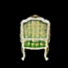
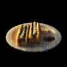
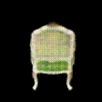
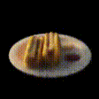

# B_NeRF_loss_augment

Improving the performance of original NeRF for a given network and given number of epochs using augmentation at loss layer.

Original reconstruction with loss layer augmentation, same network, same number of epochs

Original reconstruction without the loss layer augmentation, same network, same number of epochs

